# ВИРТУАЛЬНАЯ И ДОПОЛНЕННАЯ РЕАЛЬНОСТЬ
## Лабораторная работа №2. Программные пакеты для работы с устройствами дополненной и виртуальной реальности. Возможности Unity XR в примерах.
Отчет по лабораторной работе №2 выполнил(а):
- Дмитриев Виталий Денисович
- РИ-300014

Отметка о выполнении заданий (заполняется студентом):

| Задание | Выполнение | Баллы |
| ------ | ------ | ------ |
| Задание 1 | * | |
| Задание 2 | * | |
| Задание 3 | # | |

знак "*" - задание выполнено; знак "#" - задание не выполнено;

Работу проверили:
- к.т.н., доцент Денисов Д.В.
- к.э.н., доцент Панов М.А.
- ст. преп., Фадеев В.О.

Структура отчета

- Данные о работе: название работы, фио, группа, выполненные задания.
- Цель работы.
- Задание 1.
- Код реализации выполнения задания. Визуализация результатов выполнения (если применимо).
- Задание 2.
- Код реализации выполнения задания. Визуализация результатов выполнения (если применимо).
- Выводы.

## Цель работы
Изучить работу пакета Unity XR, настройку VR оборудования, запуск VR проекта через настроенное оборудование.

## Задание 1
### Пошагово выполнить каждый пункт раздела "ход работы" с описанием и примерами реализации задач по теме лабораторной работы.
Ход работы.
1.	Создайте новый Unity проект из шаблона `3D-Core`;
2.	Откройте вкладку `Edit -> Project settings`;
3.	Установите `XR Plugin Management`;

4.	Настройте `XR Plugin Management` на работу через SDK `OpenXR`;
5.	Настройте режим рендера VR на каждый глаз;
6.	Добавить поддержку контроллеров вашего оборудования;

Установили `OpenXR`:

Во вкладке `OpenXR` для `PC` установили `Render Mode` на `MultiPass`, чтобы рендер производился на оба глаза, а не только на один. Также в список `Interaction Profiles` добавили необходимые элементы, чтобы система автоматически распознавала контроллеры:

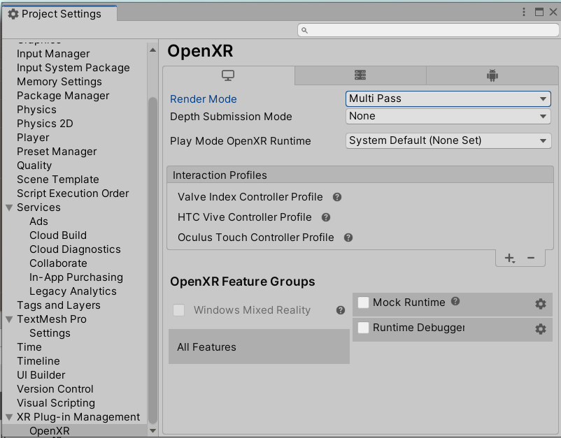

10.	Через вкладку `Windows -> Package Manager` добавьте и установите пакет `com.unity.xr.interaction.toolkit`;

Выбрали опцию `Add package from git URL`:

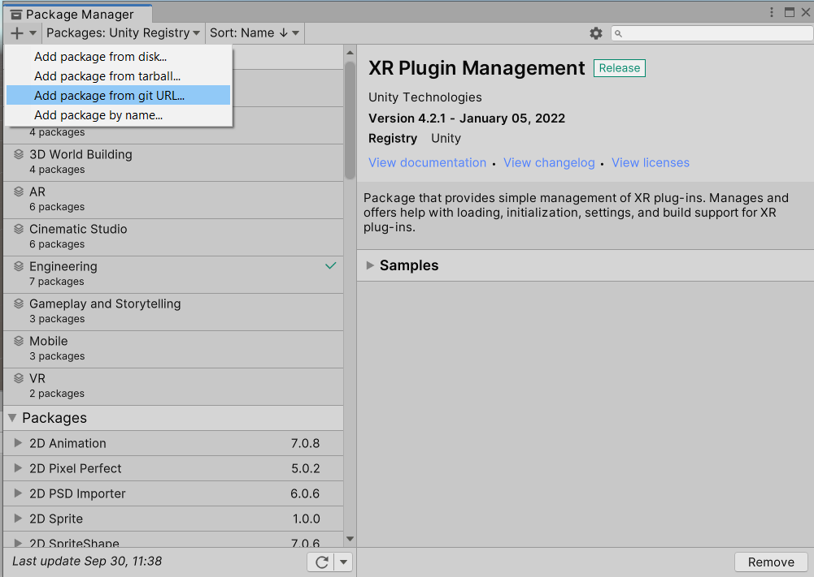

Ввели адрес:

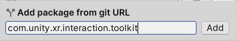

Установили:

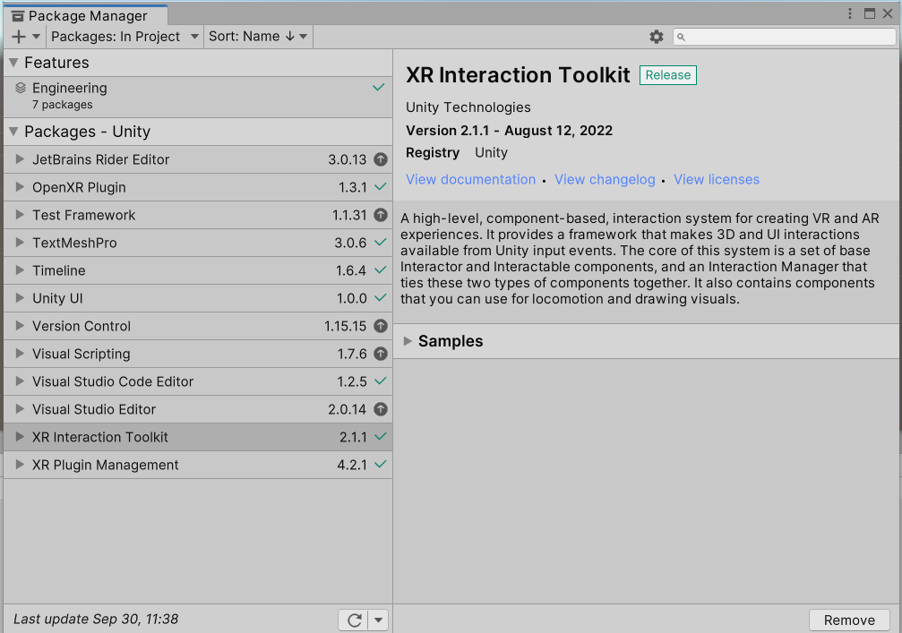

12.	Импортируйте `Starter Assets` из установленного пакета;

Открыли `Samples` и импортировали `Starter Assets`:

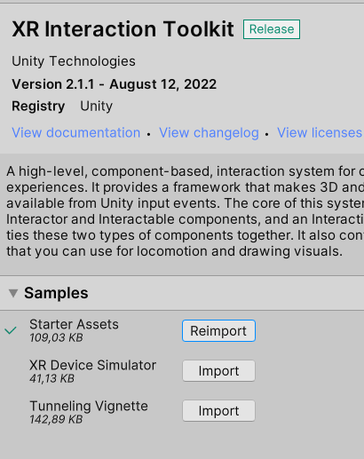

14.	Настройте `Input system` на основе импортированного `Starter Assets`;

Выбираем каждый из пресетов и добавляем их к системе управления:

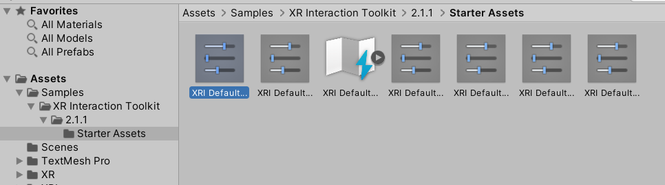

В `Project Settings` во вкладке `Preset Manager` установили фильтры для пресетов левого и правого контроллеров:

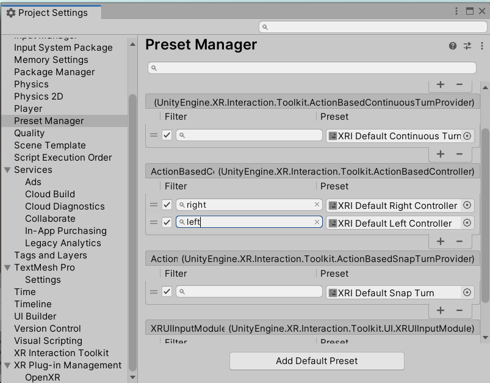

На этом настройка плагина завершена.

16.	Скачайте и установите Steam и Steam VR;
17.	Настройте и подключите к PC ваше VR оборудование;

Ниже представлена последовательность действий настройки VR-оборудования через Steam VR:

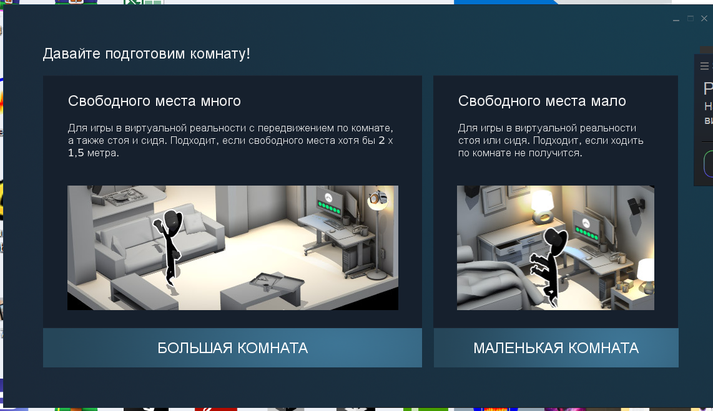

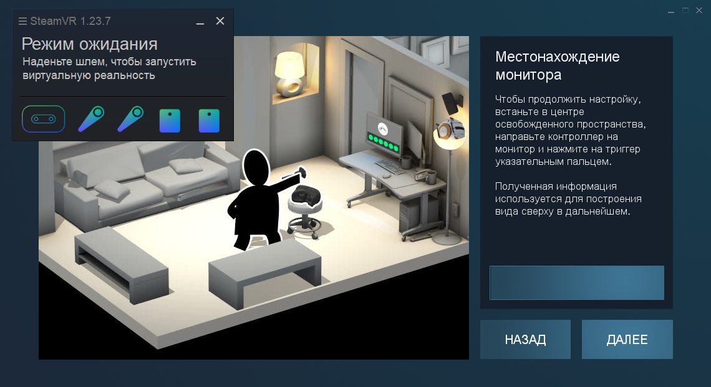

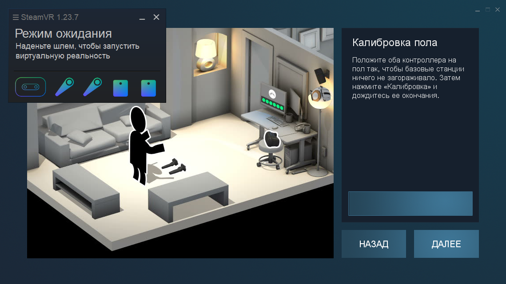

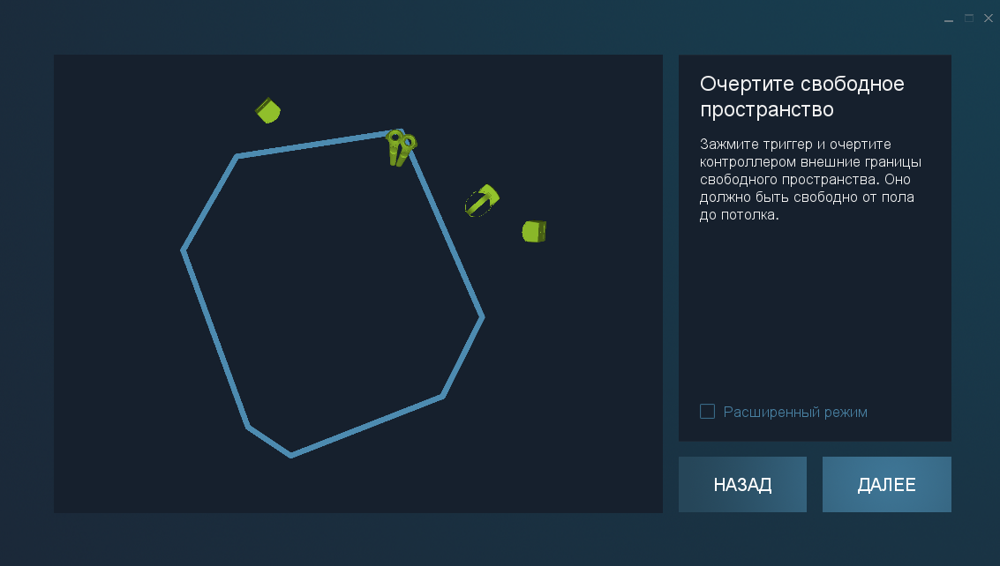

19.	Вернитесь в Unity и настройте запуск проекта через SteamVR;

В настройка проекта во вкладке `XR Plug-in Management -> OpenXR` установили `Play Mode OpenXR Runtime` на `SteamVR`:

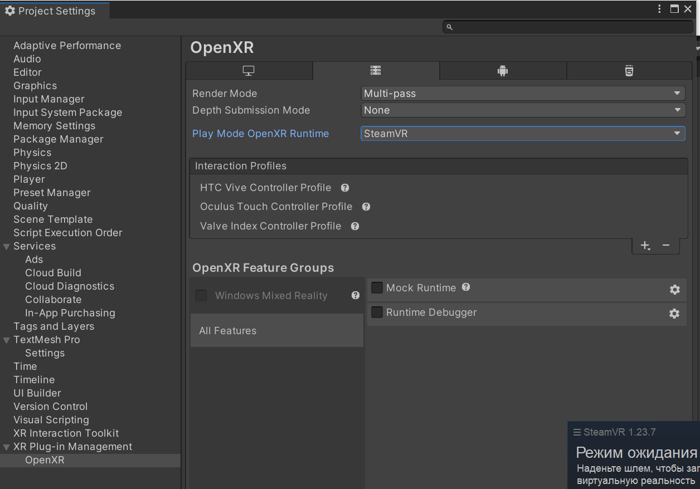

21.	 Добавьте объект `Plane`;

22.	 Добавьте на сцену объект `XR-Origin (Action Base)`;

24.	 На объект `XR Interaction Manager` создайте компонент `Input Action Manager`;
25.	 Добавьте в `Input Action Manager` настроенный `Input System`;

На объекте `XR Interaction Manager` создали компонент `Input Action Manager` и в массив `Action Assets` добавили настроенный `Input System` из директории `XR Interaction Toolkit -> 2.1.1 -> Starter Assets`:

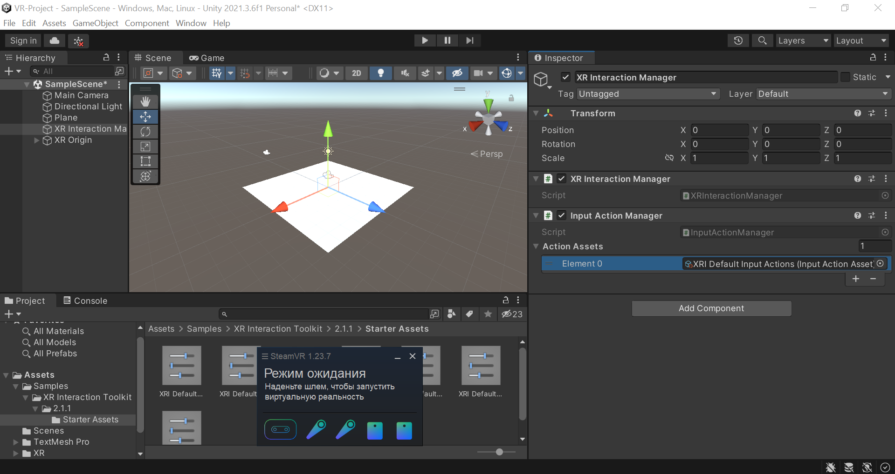

27.	 Запустите проект и убедитесь, что он воспроизводится на VR оборудовании.

После запуска проекта и использования VR-шлема и контроллеров убедились, что всё работает корректно:

## Задание 2
### Ответьте на контрольные вопросы.

•	Что значит X в аббревиатуре XR ?

X - обзначение букв V, M, A для различных типов устройств VR, MR, AR.

•	Какие SDK поддерживает `XR Plugin Management` по Default?

- ARCore (Android),
- Oculus XR,
- Open XR,
- Unity Mock HMD.

## Задание 3
### На сцену в Unity добавьте три различных элемента из `XR Interraction Toolkit`.

1. Teleportation Anchor - область, позволяющая телепортировать пользователя в указанной место на поверхности:

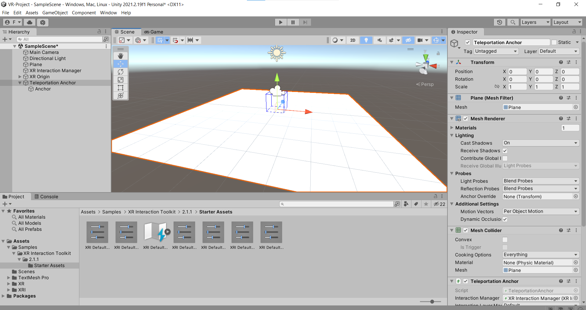

2. UI Canvas - обычное полотно для UI элементов, но с дополнительным компонентом `Tracked Device Graphic Raycaster`, позволяющим использовать отслеживаемые 3D-устройства для выделения и выбора элементов пользовательского интерфейса на этом полотне:

3. UI Event System - обыкновенный обработчик ввода, рейкастинга и отправки событий, но с дополнительным компонентом `XR UI Input Module`, позволяющим использовать контроллеры для управления стандартными виджетами пользовательского интерфейса Unity.

## Выводы

Таким образом, в результате лабораторной работы была изучена работа пакета `Unity XR`, настроено VR оборудование, а также запущен VR проект через настроенное оборудование. Кроме того, была произведена настройка `XR Plugin Management` и `XR Iteraction Toolkit`.

## Powered by

**BigDigital Team: Denisov | Fadeev | Panov**
